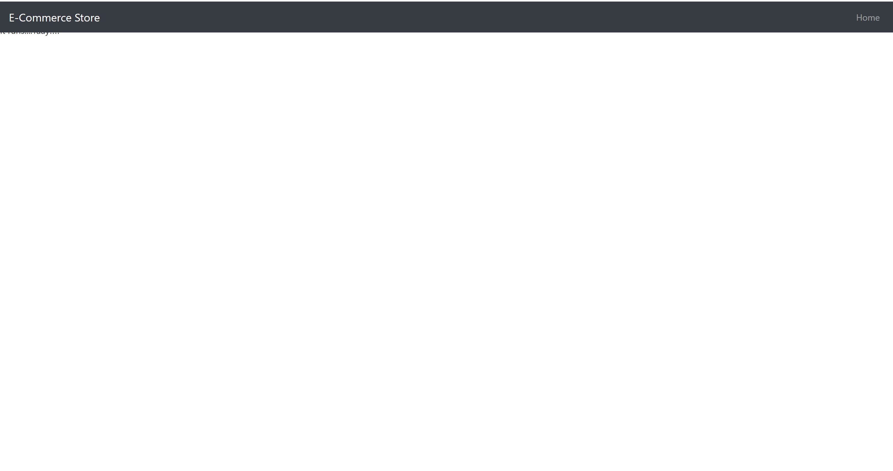

# E-Commerce Store

------------------------------

# E-Commerce Store
#### E-Commerce Store
##### *Authors: Ian Gifford & Mike Kelly*

------------------------------

## Description
This C# program is a mock e-commerce site.  

------------------------------

## Getting Started
Clone this repository to your local machine.
```
$ git clone [https://github.com/Michael-S-Kelly/]
```
#### To run the program from Visual Studio:
Select ```File``` -> ```Open``` -> ```Project/Solution```

Next navigate to the location you cloned the Repository.

Double click on the ``` ECommerce ``` directory.

Then select and open ``` EComerce.sln ```

------------------------------

## Visuals


##### Application Start



------------------------------

## Change Log


------------------------------
## Collaborators, Contributors, and Other Resources used

### Collaborators

### Contributors
Michael Kelly
Ian Gifford


### Other Resources
#### Microsoft Visual C# Step by Step Ninth Edition
#### C# 7.0 in a Nutshell
#### C# Pocket Reference
#### C# and .NET Core Test-Driven Development

------------------------------
For more information on Markdown: https://www.markdownguide.org/cheat-sheet

# Introduction 
TODO: Give a short introduction of your project. Let this section explain the objectives or the motivation behind this project. 

# Getting Started
TODO: Guide users through getting your code up and running on their own system. In this section you can talk about:
1.	Installation process
2.	Software dependencies
3.	Latest releases
4.	API references

# Build and Test
TODO: Describe and show how to build your code and run the tests. 

# Contribute
TODO: Explain how other users and developers can contribute to make your code better. 

If you want to learn more about creating good readme files then refer the following [guidelines](https://www.visualstudio.com/en-us/docs/git/create-a-readme). You can also seek inspiration from the below readme files:
- [ASP.NET Core](https://github.com/aspnet/Home)
- [Visual Studio Code](https://github.com/Microsoft/vscode)
- [Chakra Core](https://github.com/Microsoft/ChakraCore)